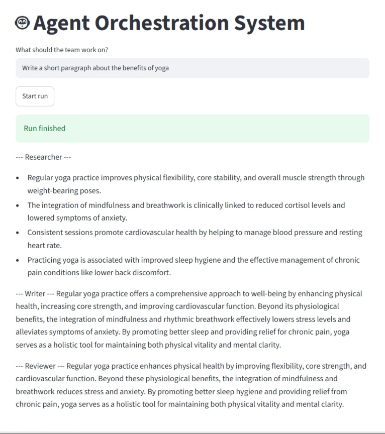

# 🤖 Agent Orchestration System

A multi-agent system where a **Supervisor** delegates work to specialist agents,
with tool use, persistent memory, and **human-in-the-loop approval**.

Built with Python, LangGraph, Google Gemini, SQLite, and Streamlit.


## Features

- **Supervisor delegation**: an LLM decides which agent works next, or when the goal is done (LangGraph conditional edges)
- **Specialist agents**: Researcher, Writer and Reviewer, each with its own role
- **Tool use**: agents can call Python functions (calculator, clock)
- **Persistent memory**: finished runs are saved in SQLite and reused as background for related goals
- **Human-in-the-loop**: the graph pauses for approval before the Writer runs, and resumes on Approve or Reject
- **Web UI**: Streamlit page with Approve / Reject buttons
- **Swappable LLM**: all model calls go through one wrapper (`app/llm.py`)
- **Safety limit**: the Supervisor loop stops after a maximum number of steps

## How It Works

```
START -> Supervisor -> Researcher -> Approval (human) -> Supervisor
                                          |
                                       reject -> END
Supervisor -> Writer -> Supervisor -> Reviewer -> Supervisor -> DONE
```

1. You enter a goal in the UI.
2. Related past runs are pulled from memory as background.
3. The Supervisor picks the next worker (Researcher, Writer or Reviewer) or finishes.
4. After the Researcher, the graph pauses and asks you to approve or reject the notes.
5. When the Supervisor says DONE, the result is saved to memory.

## Project Structure

```
AgentOrchestrationSystem/
├── app/
│   ├── llm.py         # LLM wrapper: ask(prompt, system, tools)
│   ├── agent.py       # Agent class (name, role, tools)
│   ├── tools.py       # calculator, get_time
│   ├── memory.py      # SQLite save_run / get_runs / find_related
│   ├── supervisor.py  # simple standalone supervisor (before LangGraph)
│   └── graph.py       # LangGraph workflow with approval step
├── ui.py              # Streamlit web interface
├── test_*.py          # small scripts that test each piece
└── README.md
```

## Tech Stack

| Part | Technology |
|------|------------|
| Orchestration | Python, LangGraph |
| LLM | Google Gemini (via `google-genai`) |
| Memory | SQLite (keyword search) |
| Frontend | Streamlit |

## Getting Started

1. **Clone the repository**
```
   git clone https://github.com/27rakshitapatil-sys/agent-orchestration-system.git
   cd agent-orchestration-system
```
2. **Create and activate a virtual environment**
```
   python -m venv .venv
   .venv\Scripts\Activate.ps1
```
3. **Install packages**
```
   pip install langgraph google-genai python-dotenv streamlit
```
4. **Add your API key.** Get a free key from [Google AI Studio](https://aistudio.google.com), then create a `.env` file:
```
   GEMINI_API_KEY=your-key-here
```
5. **Run the app**
```
   streamlit run ui.py
```
6. Open `http://localhost:8501`, type a goal, click **Start run**, then **Approve**.

## Example Goals

- Write a short paragraph about the benefits of yoga
- Write a short paragraph about the benefits of reading

## Roadmap

- [x] Demo screenshot
- [ ] PostgreSQL for run history
- [ ] ChromaDB for semantic memory (search by meaning)
- [ ] Redis + Celery for background runs
- [ ] React frontend
- [ ] Support for OpenAI and Anthropic models in the LLM wrapper

## Notes

- The `.env` file and `memory.db` are excluded from git via `.gitignore`.
- Model names change often. If a model returns an error, run `list_models.py` to see which models your key can use, then update `MODEL` in `app/llm.py`.